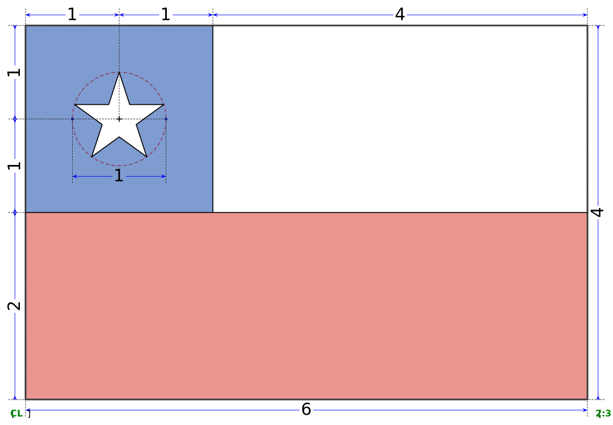

## Construction

(https://en.wikipedia.org/wiki/Flag_of_Chile)

The construction of the flag of Chile, at present, is officially defined in Supreme Decree No. 1,534 of the Ministry of the Interior, published in  1967, on the use of national emblems, which systematized and  consolidated various laws and regulations on the subject. (Other laws  include Law No. 2,597 of 11 January 1912, concerning the colors and  proportions of the national flag, the presidential sash and rosette or cockade, and Supreme Decree No. 5805 of the Ministry of the Interior,  published 26 August 1927, sets the size of the national flag for use in  buildings and public offices.) According to the decree, the ratio  between length and width of the flag is 3:2, being divided horizontally  into two bands of equal size. While the lower section corresponds to the color red, the upper area is divided once in a blue square and a white rectangle whose lengths are in proportion 1:2, respectively. The star is located in the center of the blue canton and is constructed on a circle whose diameter is half the side of the canton.

## Colours scheme

The exact color shades are not defined by law, but they are listed as "turqui blue", "white" and "red". Approximations below:

|                                                              | Blue           | Red           | White       |
| ------------------------------------------------------------ | -------------- | ------------- | ----------- |
| **[RGB](https://en.wikipedia.org/wiki/RGB_color_model)**     | 0-57-166       | 213-43-30     | 255-255-255 |
| **[Hexadecimal](https://en.wikipedia.org/wiki/Hexadecimal)** | #0039a6        | #d52b1e       | #FFFFFF     |
| **[CMYK](https://en.wikipedia.org/wiki/CMYK_color_model)**   | 100, 66, 0, 35 | 0, 80, 86, 16 | 0, 0, 0, 0  |